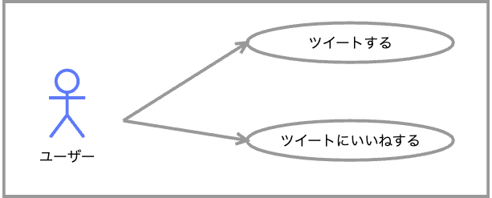
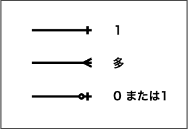
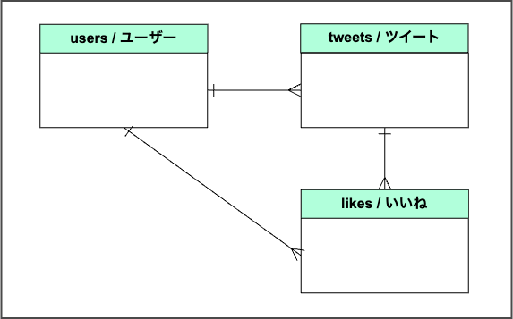
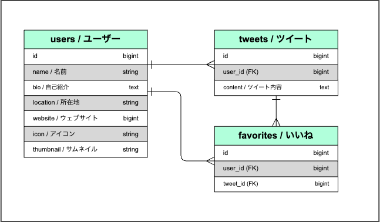

# ER図とは
データベースの設計を行う際には、どのような エンティティ(Entity) が必要で、それらのエンティティ同士はどのような 関係性(Relation) にあるのかを表現するために、ER図(Entity-Relationship Diagram)が利用されます。ER図は、Webアプリケーションにおけるデータの扱い方にとって非常に重要な工程であり、テーブル設計は実装を進める中で徐々に追加や修正が困難になってくるため、設計段階でしっかりと行う必要があります。  
  
※ エンティティ(Entity)とは、データベースにおいて、独立した意味を持つ情報の集合体を指します。具体的には、人や商品、注文、注文明細などのオブジェクトや、それらの属性や状態を表現する情報を指します。エンティティは、データベースにおいてそれぞれテーブルで表現され、1つのエンティティは1つのテーブルに対応します。

### 作成手順
- ユースケース図でエンティティを書き出す
画面設計が固まったら、データ設計を行う前に、システムを利用する登場人物や外部システム、そしてそれらが取る行動を洗い出すことが重要です。この洗い出しには、ユースケース図が最適です。ユースケース図を用いることで、システムの利用方法や目的が明確になり、データ設計を行う際に必要なデータ項目やテーブル構成などを洗い出すことができます。  
  
以下にTwitterのユースケース図の例を記載します。（一部のみ抜粋しています）

### ER図の作成
例)  

### ER図作成手順
ユースケース図が書き終えた後、ER図を作成するために以下の手順を行います。

1. ユースケース図からエンティティを抽出
2. エンティティ間の関係性を文章で書き出す
3. リレーションを用いてER図を作成
4. テーブルの設計

### 1. ユースケース図からエンティティを抽出
以下のTwitterの機能を一部抜粋したユースケース図を例に、どのようなエンティティが存在するか抽出していきます。  

- ユーザー
- ツイート
- いいね
このように、ユースケース図で表現したものの中から、システム内で扱うデータや情報の実体としてエンティティとなりうるものを抽出していきます。 

### 2. エンティティ間の関係性を文章で書き出す
次にエンティティ間の関係性を文章で書き出していきます。  
エンティティ間の関係性は1対1、1対多、多対1などで表現します。  
1対多で表現した関係性は反対から見た場合多対1となります。  

- ユーザーとツイートの関係性  
    - ユーザーは複数のツイートが出来る
    - ユーザとツイートの関係性は 1対多
- ツイートといいねの関係性
    - ツイートに対して複数のいいねがつく
    - ツイートといいねの関係性は 1対多
- ユーザーといいねの関係性
    - ユーザーは複数のいいねを押せる
    - ユーザーといいねの関係性は 1対多
※ ユーザーは1つのツイートに対して1つのいいねしか押すことができないため、この制限についてはER図において直接表現する必要はありません。代わりに、後述するカラムの設計において、いいねを表すカラムにユニーク制約（一意制約）を設定して表現します。したがって、この制限についてはここでは詳細な説明を省略します。  

### 3. リレーションを用いてER図の作成
エンティティ間の関係性をER図で表現するには、リレーションとカーディナリティ（多重度）の概念を理解する必要があります。リレーションはエンティティ間の関係を表現する線であり、カーディナリティはリレーションにおいて各エンティティの関係性における対応数を表現する記号となります。  

**カーディナリティ**

**Twitterの例をテーブルのリレーションに変換**

### 4. テーブルの設計
ER図に基づいてテーブルを設計する場合、各エンティティに対応するテーブルを作成し、必要なカラムを洗い出していくことになります。各カラムには適切なデータ型や制約を設定し、適切な命名規則に従ってテーブル名やカラム名を付ける必要があります。適切な名前が思いつかない場合はChatGPTを利用して候補をもらうこともできます。  

**Twitterの事例を用いたテーブル設計**

※ FK = Foreign Key（外部キー）の略です。

### サービスのER図を作成する際の注意点
- 正規化はデータベース設計において非常に重要な概念であり、データの整合性や効率性を高めるために適用される為、第3正規化までは適宜行ってください。
- ER図には必要最低限のテーブルを含めることが望ましいですが、MVP以降の機能で必要になるテーブルについては、MVP段階のテーブルとの関連性やデータの流れなどを考慮し、場合によっては初期に追加しておいてください。一方、カラムに関しては、後からの追加や変更が容易であるため、実装を進める中で必要になった場合に追加や変更を行ってください。
- 就活準備に入る前にその時の状態でテーブルをFIXさせ、ER図をアプリケーションに合った正しい情報で起こしてください。出来上がったER図は画像出力し、READMEに画像タグで表示させておくことで、採用担当者に好印象を与えることが出来ます。