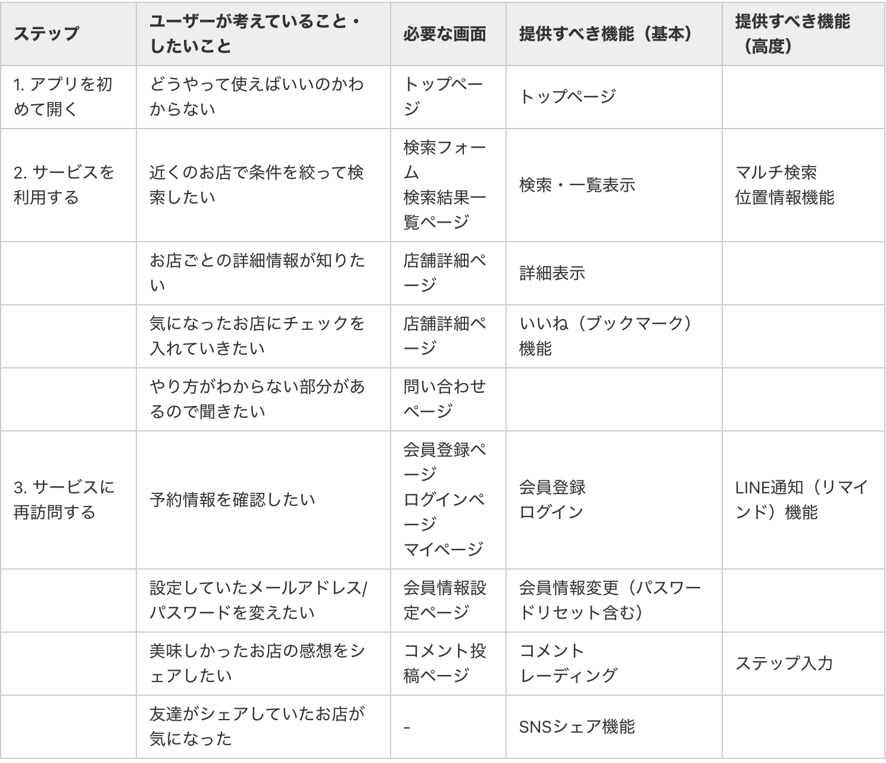
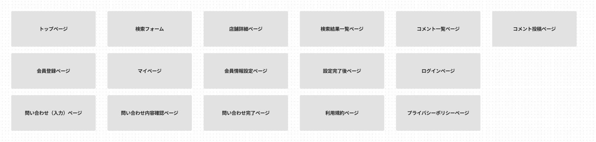
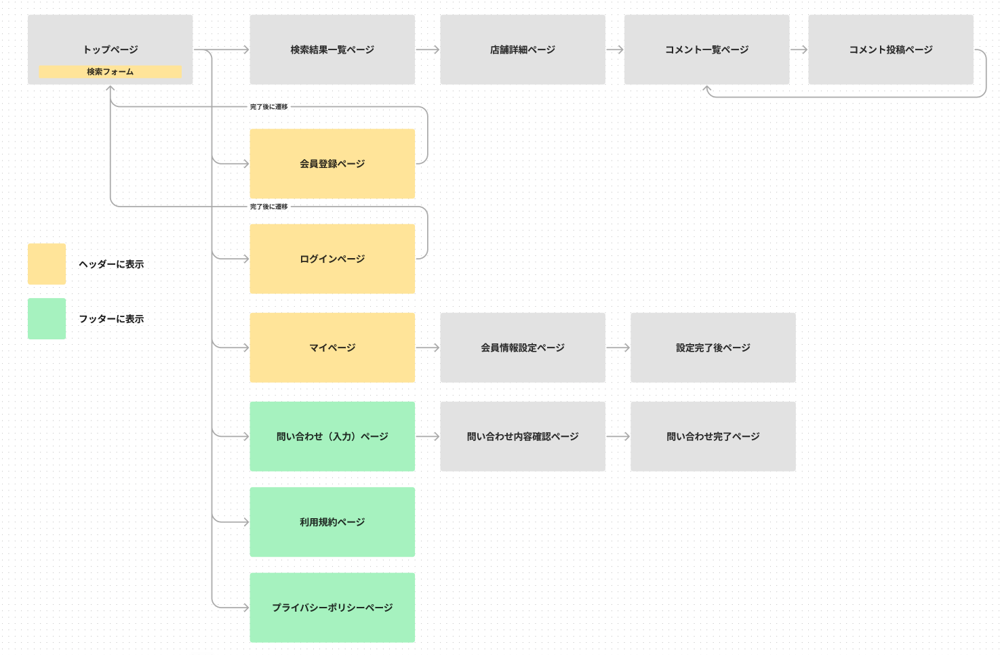

# 画面遷移図とは
画面遷移図とは、Webサイトやシステム開発の際に、画面が表示される順番や画面同士の相互関係を理解するためにまとめる図です。サービスの全体像を捉えることにより、認識の相違やページの抜け落ちなどを避けられます。  

## ユーザー体験（UX）を整理する
※UX…UserExperienceの略  
  
Webアプリの画面設計に入る前に、まずはアプリを使用するユーザーの体験（UX）を考えていくことが大事です。ユーザーの行動を整理できていない状態でいきなり画面設計に入ってしまうと、ユーザーにとって使いにくいアプリになってしまいます。  

スムーズなユーザー体験を設計するために、情報の整理を行っていきましょう。  

### 整理のためのヒント
サービスコンセプトが似ているサービスを実際に触りながらユーザーの気持ちになって考えてみると、アイデアが浮かびやすくなります。  
- 提供すべき機能（基本）：MVPリリース時に必要になってくる基本機能です。 アプリ開発カリキュラム「基本機能」 を参考にしてください。
- 提供すべき機能（高度）：本リリース（就活） 時にあると望ましい機能です。 アプリ開発カリキュラム「高度な機能」 を参考にしてください。
例：飲食店検索アプリ  

  
## UXを元に画面マップを作成する
ここからは考えたUXをWebアプリ上に落とした時に、どういった構造になるかサイトマップを作って整理をしていきます。  

※この作業ではFigma（https://www.figma.com/ ）を使うことがあります。  
※Figmaの登録方法やファイル作成方法について：こちらのページをご確認ください。  

1. 想定されるページ（機能）の書き起こし（Figma or 紙でもOK）
ざっくりでもよいので想定される全てのページ・機能を書き起こします。

- 上記UXを整理して必要だと思った画面
- 基本的なWebサービスに搭載されている画面
ユーザーが使う場面は少ないかもしれませんが、「利用規約」「プライバシーポリシー」は入れることを推奨します。

2. 各画面のつながりを整理する（Figma or 紙でもOK）
上記で書いた箱書きをユーザーの体験の流れに沿って、整理をしていきます。

### ヘッダー・フッターについて
- ヘッダー：常にユーザーがクリックしたいと思われるページに関しては、ヘッダーにもリンクを置くことをお勧めします。
- フッター：常に必要ではないが、どの画面においても必要になる可能性があるページに関しては、フッターにもリンクを置くことをお勧めします。
3. 各画面のUIをデザインする（Figma）
※UI：User Interfaceの略

2で作成した画面遷移設計を元に、各画面のUIをデザインしていきます。  

ポイント  
デザイナーではないので、完璧なデザインを描く必要はありません。
ただし、ユーザビリティは意識しましょう。
複雑なデザインや過剰な要素は避け、シンプルで直感的なデザインになっているか
人間は基本的に、左→右・上→下に情報を閲覧するので、その流れに沿ったUIデザインになっているか
メニューやボタンに適切なラベルをつけ、ユーザがそれが何をするものかすぐに理解できるようなっているか
ユーザビリティを意識した画面設計を考える際、サービスコンセプトが似ている他社サービスを実際に触りながら考えることをおすすめします